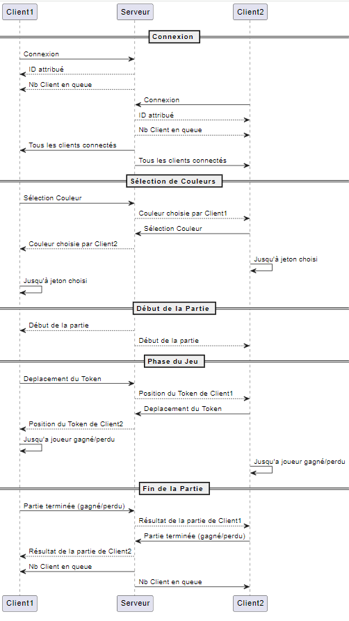

# projet-puissance4

Groupe : Basma Malki & Justine Bernier

### Installation

- `git clone https://github.com/basma-malki/projet-puissance4.gitè
- Allons dans le dossier racine du projet, puis,
- ```go build```


### Utilisation de flag

Pour exécuter le jeu, il suffit de faire cette commande :
(Sur Windows)
- ```.\puissancequatre.exe --port:8080```

(Sur Linux)
- ```.\puissancequatre --port:8080```

Le jeu utilise Flag pour permettre de changer son adresse IP et/ou son port :
- ```.\puissancequatre.exe --port:8080```

### Schéma serveur-clients



## Choix pour la communication client/serveur
Nous avons en priorité penser à une structure d'échange fiable qui nous permettra par la suite de réaliser simplement les extensions. Nos messages d'échanges commencent tous par un caractère définit dans `network/codes.go` permettant d'identifier le type d'information à gérer et ainsi pouvoir la gérer correctement que ce soit coté client ou serveur.

Avec ce système, nous pouvons alors des conditions comme celle-ci :
```go
select {
	case message := <-g.readChan:
		if message == network.ALL_CONNECTED {
			// Some code.
		}

		if message[:1] == network.CLIENTS_IN_QUEUE && !g.readyNextStep {
			// Some code.
		}
	default:
	}
```

## Extensions & compléments

Les quatres extensions sont implémentées (dans draw.go et update.go) et fonctionnelles dans le puissance quatre et on peut voir l'identifiant de chaque client en haut à gauche sur leur fenêtre de jeu et combien de joueurs sont connectés.